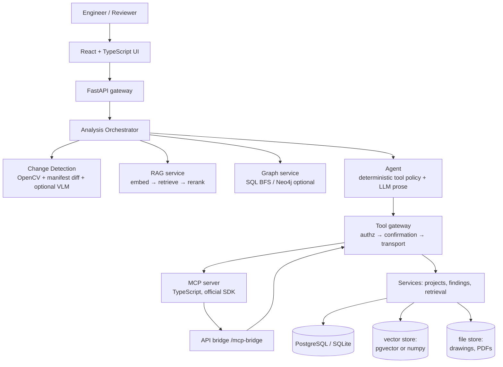

# ARIADNE — architecture

ARIADNE is a **local-first decision-support platform** for engineering revision
review. It detects what changed between two revisions, traces what those
changes may affect, retrieves the governing evidence, computes deterministic
rule checks, and proposes review findings that a human must approve.

It is *not* an autonomous compliance system and it is not an official Autodesk
product or integration.

## System overview

## Components

### Frontend (`apps/web`)
React 18 + TypeScript (strict) + Vite + Tailwind + TanStack Query + React Flow.
Dark, dense, CAD-inspired workspace: split-screen drawing comparison with
translucent change overlays, change list, impact panel, evidence panel,
dependency graph, document viewer with block provenance, chat with always-
visible tool calls, audit trail, evaluation dashboard.

### API (`apps/api`)
FastAPI + SQLAlchemy 2.0 + Pydantic v2 + Alembic. Runs on SQLite with zero
infrastructure (dev/demo) or PostgreSQL + pgvector (compose). Structured JSON
logging with request/analysis/user correlation ids. Every failure maps to a
typed `AppError`; stack traces never reach clients.

### Analysis pipeline (9 stages)
`loading_revisions → aligning_drawings → detecting_changes →
classifying_changes → mapping_components → traversing_dependencies →
retrieving_evidence → generating_impact → preparing_review`.
Runs asynchronously; progress events are persisted and polled by the UI.

### Change detection (layered, never LLM-only)
1. normalisation (Gaussian + contrast),
2. registration (ORB + RANSAC partial affine),
3. absdiff + morphology + connected components → candidate regions,
4. manifest diff (ground-truth structure of the synthetic drawings),
5. cross-check: a manifest change confirmed by a CV region gets
   `confidence 0.94 / method hybrid`; otherwise `0.71 / structured`;
6. CV regions with no manifest item are reported as *unmapped pixel
   differences* (low confidence, not interpreted);
7. optional VLM interpretation (`VISION_ENABLED=1`) adds descriptions only —
   structured values always come from the manifest.

### RAG
Ingestion: PDF (pypdf) + layout sidecar → chunks with page/section/bbox →
metadata enrichment (component ids, revision, authority) → embeddings →
vector store. Retrieval: query planner (component / change / relationship /
normative dimensions + sub-queries) → strategy (keyword | vector |
metadata_aware | revision_aware | hybrid) → deterministic feature reranker
whose weights are returned with every result. See `docs/rag.md`.

### Knowledge graph
`GraphStore` protocol. Default `SqlGraphStore` (BFS over the `dependencies`
table, configurable depth, default 2 hops). `Neo4jGraphStore` activates when
`NEO4J_URI` is set and the driver imports; otherwise SQL — the choice is
reported in every response (`store` field).

### Agent
Tool *selection* is a deterministic policy (measurable, offline-capable); the
LLM composes grounded prose from structured tool outputs (live mode). The
agent never mutates state: it proposes findings and requests confirmations.

### MCP (`apps/mcp-server`)
TypeScript, official `@modelcontextprotocol/sdk`, streamable HTTP. Twelve
tools with zod schemas mirroring the Python registry (a parity test enforces
this). Mutating tools refuse calls without an approved confirmation id; all
authorization is enforced again server-side in the API bridge.

### Database
Single relational schema (25 tables) covering projects, revisions, drawings,
components + per-revision property snapshots, dependencies, documents,
chunks, requirements, vector records, analyses, changes, tool executions,
confirmations, findings + evidence, chat, audit, evaluation.

## Security model
* Roles VIEWER/ENGINEER/REVIEWER/ADMIN with a permission catalogue; enforced
  in FastAPI dependencies **and** in the tool gateway **and** in MCP tools.
* Mutating tools require a `Confirmation` row with status `approved` and a
  matching SHA-256 digest of the arguments (tamper guard); confirmations are
  single-use.
* Documents are untrusted data: instruction-shaped content is quarantined
  (`core/content_security.py`) and untrusted authorities never enter evidence
  synthesis.
* Parameterised queries everywhere (SQLAlchemy); input validation via Pydantic
  and zod; no secrets in source (`.env.example` only).

## Design principles
1. The LLM reasons; the backend verifies.
2. The graph represents relationships.
3. RAG provides evidence.
4. MCP provides controlled actions.
5. The human remains responsible for engineering decisions.
6. Everything important is auditable.
7. Do not use AI where deterministic software is better.
